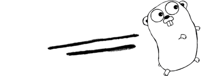

# Go lang

##### Bắt đàu nghiên cứu 09/2007 và được phát triển năm 2008 là ngôn ngữ lập trình mỡ, xử lý đa luồng, song song và tức thời.
Tốc độ biên dịch nhanh, cách coding đơn giản và ngắn gọn. #####

### Biểu tượng là con linh vật Gopher

